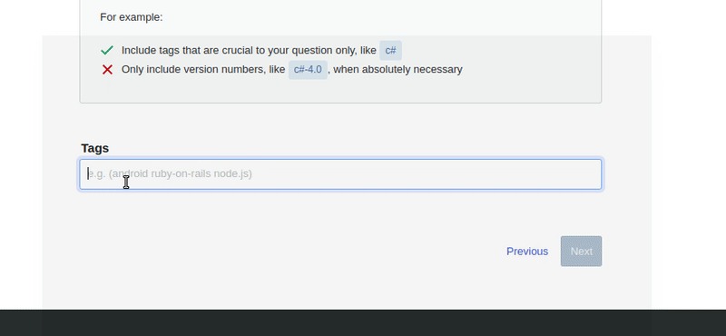
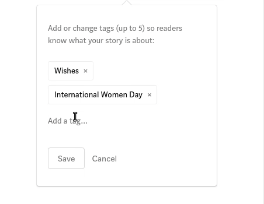

# Tagging with Mongo

Xây dựng hệ thống tags với MongoDB và tìm hiểu những trigger các rule liên quan.

* [Tags](#tags)
* [Sign](#sign)
* [Design DB](#design-db)
* [Demo](#demo)

## Tags ?

Nhóm các bài viết có nội dung tương tự, không tổ chức thành cấu trúc, tập trung vào phân loại nội dung thay vì chủ đề.

## Signs

- Syntax:
  - Sử dụng seperator (phân chia giữa các tag): `space character` hoặc `comma`
  - Sử dụng HTML rel-tag (i.e., rel="tag") 
  
- Best practies:
  - Mỗi tags ít nhất 3 ký tự còn cụm từ nhiều nhất là 5 từ, min 3 characters max 5 words.
  - Chữ  thường không in hoa, giúp dễ nhận dạng và tạo sự khác biệt so với categories (thường in hoa). Ở 2 trang:
    - Medium: ký tự đầu mỗi từ viết hoa, mỗi từ cách nhau khoảng trắng, seperator giữa các tags là khoảng trắng, vd: Python, Data Science, Beginner, How To, Tutorial.
    - Stackoverflow: toàn bộ viết thường, mỗi từ cách nhau dấu "-" và seperator giữa các tags là khoảng trắng, vd: reactjs react-native 
react-native-navigation react-native-navigation-v2.
  - Giới hạn số lượng tags trong bài viết, không có một quy định hay con số cụ thể nhưng nếu nhiều quá sẽ giảm tính hữu dụng và không dễ dàng truy cập các tags. Tùy vào nội dung đề cập đặc biệt trong bài post mà qui định số lượng. Ở mức tổng quan thì sẽ xem các trang:
    - Medium: <= 5 tags/post
    - Stackoverflow: <= 5 tags/ask
  - Cung cấp đoạn mô tả ngắn cho những tags phổ biến.
  - Count số lượng bài viết được gán tag.
  - Sort tags theo thời gian, mức độ phổ biến, theo tên alphabet..
  - Tìm kiếm tags theo tên.

- Notes:
  - Từ đồng âm (từ giống nhau nhưng khác nghĩa) như tag `orange` nó là `fruit` hay `color`
  - Từ đồng nghĩa (nhiều tag cùng khái niệm) như tag `Linux kernel` có thể tạo từ tag liên quan là `Linux`, `kernel`, `Penguin`, `software`
  - Số ít hay số nhiều như tag là `tag` hay là `tags` 
  - Một số tags thừa không sử dụng trong hệ thống: gear, custom, create, gifts,  presents, gift idea, products, merchandise, personalize, personalized, personalizable, customize, customized, customizable, custom made, customise, customisable, customised, made to order,  make your own, personal, personalised, personalise, personalisable.
  - Chọn những từ đại diện chung hơn là đi vào chi tiết, thay vì “dresses”, “summer dresses”, và “sleeveless dresses” thì bộ tag tốt nhất sẽ là “dresses”, có thể là “sleeveless” hoặc “summer” -> từ độc lập có nghĩa.
  - Thêm mô tả cho tag cho đủ nghĩa "programmable coffee makers" thay vì "programmable", "coffe" điều này sẽ gây nhầm lẫn về nghĩa cũng như quán coffe, thức uống coffe, ngôn ngữ lập trình coffee scirpt -> ngữ cảnh này cần bổ sung thêm nghĩa cho tag.
  - Cần phải kiểm duyệt tag mới của user và admin phải search từ hệ thống trước khi đưa vào bộ tags.
  - Không tạo tag chỉ dành cho một post.
  - Không tạo tag giống với category.

## Design DB


```text
Data Basic Examples           
            
+-------------+
| Posts       |
| - Id        |  
| - Tags[, ,] |   
+-----+-------+
      |
      |
+-----+-------+
| Tags        |
| - Id        |  
| - TagName   |   
+-------------+
```

```javascript
{
    "_id" : "Java 8 and MongoDB",
    "author" : "Donato Rimenti",
    "tags" : ["tag-id-1", "tag-id-2", "tag-id-3", "tag-id-4"]
}
```

## Demo

### 1. Thêm tags khi ask mới ở Stackoverflow

Lưu cả tag mới của user nhập vào.



### 2. Thêm tags khi post mới ở Medium

Khi nhập một tag hệ thống sẽ list ra cái có sẵn, bắt buộc user lấy tag có sẵn, tag không có trong hệ thống sẽ không thêm vào được.



## Ques

- Khi có nhiều tags thì phân loại tags này theo chủ đề bằng cách nào (subtitle)? ví dụ: react (javascript-lib/ programming) hay react (feeling) 
- Khi tag đã cũ không cho hiển thị nữa (dùng cờ đánh dấu chứ không xóa)

## Refers

- "tags best practices", "design tagging", "taging with MongoDB"
- https://en.wikipedia.org/wiki/Tag_(metadata)
- https://www.searchenginejournal.com/category-tag-pages-seo/199598/
- https://www.hostinger.vn/huong-dan/taxonomy-la-gi/
- https://www.elegantthemes.com/blog/tips-tricks/best-practices-for-using-categories-and-tags-in-wordpress
- https://themegrill.com/blog/using-wordpress-tags-and-categories-for-seo/
- https://help.zazzle.com/hc/en-us/articles/115000373127-Title-Description-Tagging-Best-Practices
- https://meta.stackexchange.com/questions/100017/how-have-tags-been-stored-in-the-stack-overflow-database-design

## Notes temp

```txt
- Tìm vấn đề và giải thích vì sao?
- Ví dụ:
  - Giới hạn 5 tags 1 bài post, giống Medium
  - Không cho người dùng tự đăng tags, cần approve
  - Chữ phải format lại thường giống như Stackoverflow
  - Count số bài được gắng tag này
  - ...
- Đưa ra vấn đề như:
  - Thêm khi lưu thêm thời gian nữa: để .... nó giúp ích cho việc ....
  - ...
- Ex:
  - https://stackoverflow.com/tags
  - Medium.com

-> Không cần quan tâm đến kỹ thuật, đứng ở 1 khía cạnh là product - đưa ra những vấn đề
```
